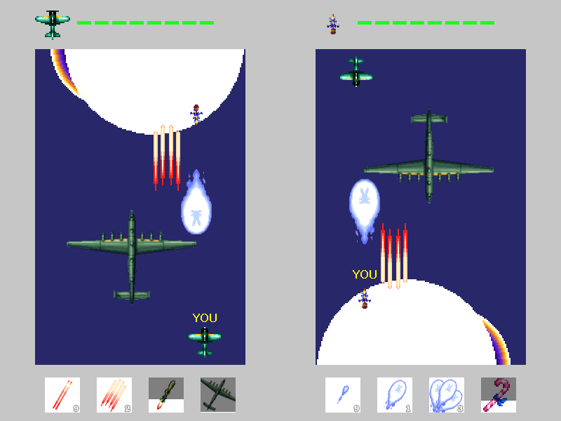

# Dodge And Shooting (DAS)

===============

##0.  들어가기 전에   
동아리 여름방학 프로젝트로 만든 슈팅게임입니다.  
모티브가 된 게임은 동방화영총. 그리고 스타크래프트 유즈맵 에어로파이터즈 입니다.   

- - -

##1. 소개 및 기능   
DAS는 2인 대전 종스크롤 슈팅게임입니다.    
2D 대전 슈팅게임은 보통 1P화면과 2P 화면을 나누거나, 혹은 하나의 화면을 두 플레이어가 공유하는 형식의 2가지가 있습니다.    

전자의 예시인 동방화영총, 트윙클 스타 스프라이트 등의 게임에서는 둘이서 대전한다는 느낌이 들지 않습니다. 이런 게임들에서는 의도한 위치에 방해물을 설치하거나, 하는 등 직접적으로 상대를 공격한다는 느낌이 들지 않습니다.     

후자의 예시인 에어로파이터즈는 탄막의 패턴을 본인이 직접 만듦으로써 상대를 직접적으로 공격한다는 느낌을 받을 수 있습니다. 다만 이 게임에서는 스타크래프트 유즈맵의 한계상 횡스크롤 형식으로 구현했으며, 좌측 플레이어와 우측 플레이어의 영역이 좌우반전된 형태라는 것이 아쉽습니다.      

DAS에서는 하나의 맵을 2개의 화면으로 나누어 구현했습니다. 각 플레이어의 화면에서는 자신의 캐릭터가 화면 아래쪽에, 상대의 캐릭터가 화면 위쪽에 위치합니다. 이를 통해 종스크롤 슈팅 게임의 화면 특징과 상대를 공격한다는 느낌을 결합하였습니다.

현재 버전에서 사용 가능한 캐릭터는 3가지입니다.

- - -

##2. 사용 키     
DAS에서는 다음 8키를 사용합니다.

    1P (왼쪽)
	이동 : F G H T
	공격 : Z X C
	방어 : A

	2P (오른쪽)
	이동 : 방향키
	공격 : , . /
	방어 : K

- - -

##3. 현재 시점에서의 감상    
동아리 활동으로 제작한 게임 중 가장 완성도가 높다고 생각하는 게임입니다. 제작 과정에서는 네트워크를 통한 2인 대전 기능을 추가하고 싶었으나 넣지 못했습니다.    

현재 사용 가능한 3가지 캐릭터 모두 나름의 완성도를 가지고 있습니다. 각 캐릭터를 디자인하면서 슈팅게임에서 있을 만한 여러 가지 공격, 그리고 봄에 대해 생각했습니다만 만들면서 가장 참신하다고 느꼈던 것은 아마 "시간을 멈추는" 것이 아닐까 합니다.    

가장 아쉬운 점이라면 배경과 대전맵을 완성하지 못했다는 정도?

- - -

##4. Release Note   
>2015년 9월 첫 제작